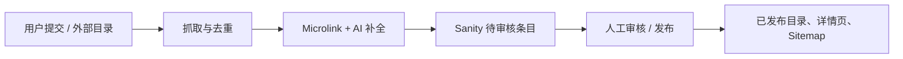

# 内容更新方式研究

**研究日期：** 2026-08-16  
**项目：** `aigc-with-me`  
**参考站点：** [MOGE](https://moge.ai/)、[AI With Me](https://aiwith.me/)

## 结论摘要

当前项目已经具备一条内容自动导入链路，但它的真实职责是“发现并创建新的待审核工具”，不是“持续更新已有工具”。项目目前的内容更新模型可以概括为：



参考站点体现出两种值得借鉴的内容经营方式：

1. MOGE 更像“多频道内容目录”：New Arrivals、Featured、Popular、Trending，以及 Tweet Highlights、Skills、Prompt 等频道并存。公开页面能确认其内容分层，但没有公开足够信息证明具体 CMS、任务调度或审核实现。
2. AI With Me 把“提交工具、付费加速、首页广告、Guest Post / Link Insert、工具内容更新”拆成了不同的业务入口，并明确说明工具介绍由抓取和 AI 生成。这是比单一的“提交一个 item”更成熟的内容运营模型。

对本项目最重要的下一步不是立即复制某个站点的 UI，而是把内容生命周期补全：

```text
发现 → 抓取 → AI 补全 → 去重 → 新建/更新草稿 → 审核 → 发布 → 复查 → 变更记录
```

## 一、项目当前的内容源头与发布链路

### 1. Sanity 是唯一主要内容源

项目在 `sanity.config.ts:24-29` 配置了嵌入式 Sanity Studio，Studio 路由位于 `src/app/(sanity)/studio/[[...index]]/page.tsx:1-10`。内容模型包含 item、category、tag、group、collection、blogPost、page 等文档类型。

因此，前台不是直接读取抓取结果或外部站点，而是读取 Sanity 中已经进入发布视图的数据。

### 2. 用户提交是“创建草稿”，不是直接发布

`src/actions/submit.ts:34-126` 会创建 `_type: "item"` 文档，并设置：

- `publishDate: null`
- `pricePlan: free`
- `freePlanStatus: submitting`
- `submitter`、分类、标签、图片和图标引用

随后，`src/actions/submit-to-review.ts:15-62` 把状态从 `submitting` 推进到 `pending`。这说明项目已经有清晰的“提交 → 送审”边界。

发布动作在 `src/actions/publish.ts:12-44` 中实现：它只把 `publishDate` 设置为当前时间。前台的 item 查询要求 `defined(publishDate)`，见 `src/data/item.ts:158-168`，所以 `publishDate` 实际上是前台可见性的核心开关。

### 3. 现有自动化是“新增导入”，不是“已有内容更新”

GitHub Actions 工作流 `.github/workflows/auto-update-items.yml:1-69` 每天 UTC 18:00 执行，也支持手动触发；默认一次处理最多 20 个候选，并提供 dry-run。

`scripts/auto-update-items.ts` 的处理过程如下：

- `:98-140` 为 `aiwith.me` 和 `moge.ai` 配置 sitemap、列表页、URL 排除规则和每个来源最多 100 个新候选；每日实际处理上限仍由 workflow 的 `limit`（默认 20）控制。
- `:219-335` 优先抓 sitemap，解析 `lastmod` 并按最近修改时间优先；失败或为空时回退到列表页链接，并做 URL 规范化和去重。
- `:455-510` 同时读取 Sanity 分类/标签、Microlink 数据和目标网站 HTML，再调用 AI 生成标题、描述、介绍、分类和标签；图片使用 Microlink 或 thum.io 截图，图标使用 Google favicon。
- `:612-640` 读取所有现有 item 的 `sourceUrl`、link 和 slug；已保存的 `sourceUrl` 会在候选上限计算前排除，因此旧候选不会占满当天的新候选池。
- `:840-920` 如果目标 link 或生成后的 slug 已存在，直接跳过，兼容历史上没有 `sourceUrl` 的 item。
- `:552-610` 新建 item 时写入 `publishDate: null`、`freePlanStatus`、`autoImported: true`、`sourceName` 和 `sourceUrl`。
- `:779-821` dry-run 只报告结果，正常运行才创建 Sanity 文档。

所以这个任务此前虽然叫 `Auto Update Items`，实际行为是：

```text
外部目录发现新候选（sitemap `lastmod` 优先）
  → 减去 Sanity 中已保存的 sourceUrl
  → 抓取与 AI 生成
  → 如果 link/slug 已存在则跳过
  → 否则创建未发布、待审核的 item
```

它不会比较已有 item 的 description、introduction、image 或分类，也不会 patch 已有文档。已有 item 的信息发生变化时，当前自动任务没有更新入口。

### 4. 前台读取和缓存存在约 60 秒延迟

`src/sanity/lib/fetch.ts:16-47` 在 published perspective 下使用 Sanity CDN，并配置 `revalidate: 60`；预览模式才使用不缓存的 `previewDrafts`。因此，Sanity 发布后，公开页面通常还可能保留约 60 秒的旧结果。

Sitemap 会读取 Sanity 中的 item、tag、collection、blog 和 page，item 的 `lastModified` 使用 `_updatedAt`，见 `src/app/sitemap.ts:118-165`。这对搜索引擎发现内容更新是有帮助的，但它并不能替代内容本身的版本比较和更新审核。

## 二、MOGE 的公开内容组织方式

### 已确认的公开事实

MOGE 首页公开展示了：

- `New Arrivals`：按新近加入的工具形成新内容入口；
- `Featured`、`Popular`、`Innovation Trends`：不同运营/推荐层级；
- `Top Headlines`、`Skills Picks`、`Prompts`：工具目录之外的内容频道；
- `Submit Product` 和 `Log in`：存在产品提交和账号入口。

MOGE 的 [首页](https://moge.ai/) 和 [Tweet Highlights 页面](https://moge.ai/ai-daily-feeds) 都显示了这种“目录 + 编辑频道”的结构。Tweet Highlights 页面还直接使用 “Real-Time Updates on Global AI Tools” 的定位。

### 对项目的启发

MOGE 的重点不是只维护一张 item 表，而是把内容拆成多个面向用户的更新流：

```text
新产品流       → New Arrivals
人工推荐流     → Featured / Popular
趋势聚合流     → Innovation Trends
外部信息流     → Tweet Highlights
专题资产流     → Skills / Prompts
```

这类分层可以让“自动导入的最新内容”和“编辑精选内容”共存，不必让所有 item 都竞争同一个首页排序。

### 未确认的部分

仅从公开页面不能确认 MOGE 的数据库、CMS、更新任务频率、是否由人工审核、是否使用 AI 自动生成。因此下面的判断只能作为产品形态参考，不能当作其内部实现事实。

## 三、AI With Me 的公开内容更新方式

### 已确认的公开事实

AI With Me 的导航和业务入口公开拆分为：

- `Submit AI`：提交 AI 工具；
- `Submit AI Pricing`：一次性提交、无限提交等方案；
- `Advertise AI`：首页 Featured Ads、Top Banner Ads、Premium Ads；
- `Guest Posts / Link Insert`：文章和链接插入；
- `Ranking`、`Blog`：榜单和文章内容。

这些入口可见于 [AI With Me 首页](https://aiwith.me/)、[提交页面](https://aiwith.me/submit/)、[提交定价页面](https://aiwith.me/pricing/) 和 [广告页面](https://aiwith.me/pricing/advertise/)。

公开 FAQ 还说明了几件对本项目很有价值的事情：

1. 提交内容通常由网站抓取信息、抽取关键内容、抓取页面截图，再由 AI 生成 SEO 友好的工具页；
2. 免费提交的等待时间更长，付费提交可以更快进入列表；
3. 一次性提交、无限提交和赞助位拥有不同的展示权益；
4. 工具介绍页不是完全自由更新的：普通更新需要单独联系处理；无限提交和赞助方案可以提交新的介绍内容进行修改。

上述信息来自 [AI With Me 提交页 FAQ](https://aiwith.me/submit/)，而不是对其后台代码的观察。

### 对项目的启发

AI With Me 实际上把内容更新拆成了三个维度：

| 维度 | 公开表现 | 对项目的对应设计 |
| --- | --- | --- |
| 内容进入 | 免费提交、付费提交、赞助提交 | `submitting → pending → approved` |
| 内容变更 | 工具介绍更新、套餐带来的更新权限 | 增加 item 更新申请和差异审核 |
| 内容曝光 | Latest / Recommend / Sponsor / Ads | `featured`、`sponsor`、`published` 等运营字段 |

这套模型比“每次重新抓取后覆盖正文”更安全：商业曝光字段和事实内容字段分开，内容更新也经过明确的授权和审核。

## 四、三者对比

| 能力 | 当前项目 | MOGE（公开可见） | AI With Me（公开可见） |
| --- | --- | --- | --- |
| 新工具进入 | 用户提交 + 自动抓取导入 | 有 Submit Product 入口 | 免费/付费 Submit AI |
| 自动发现 | 已有，针对 MOGE/AI With Me sitemap | 公开页面显示 New Arrivals，但内部机制未知 | 公开页面说明抓取和 AI 生成 |
| AI 生成介绍 | 已有 | 未确认 | 公开 FAQ 明确说明 |
| 已有工具自动更新 | 当前没有 | 未确认 | 有 Update AI 业务入口，但公开说明偏人工/付费处理 |
| 审核 | 有提交、送审、发布状态 | 未确认 | FAQ 明确提到审核/收录判断 |
| 内容频道 | item/category/blog 等基础模型 | 多频道：Featured、Trending、Tweet Highlights 等 | 工具目录 + Blog + Ranking + 广告/赞助 |
| 商业曝光 | schema/structure 中已有 sponsor 相关能力 | 公开页面未充分说明 | 公开定价页明确说明广告和赞助权益 |

## 五、建议的项目演进顺序

### P0：把“新增导入”命名和状态说清楚

当前工作流名称容易让人误以为会更新已有 item。建议把概念拆开：

- `auto-discover-items`：发现外部候选；
- `auto-enrich-items`：抓取并 AI 补全；
- `auto-import-items`：创建待审核 item；
- `refresh-existing-items`：后续真正负责已有内容复查。

同时保留现有的 `autoImported`、`sourceName`、`sourceUrl`，再增加导入批次或运行 ID，方便追踪“这条内容何时、从哪里、由哪次任务产生”。

### P1：增加已有 item 的“复查更新”链路

建议不要直接覆盖已发布正文，而是生成一份待审核变更：

```text
已有 item
  → 定期检查目标 URL / 内容摘要 / 页面截图
  → 计算变化和可信度
  → 生成 proposed changes
  → 人工接受、拒绝或逐字段修改
  → patch 已发布 item
```

首版只更新低风险字段即可：`description`、`introduction`、`image`、`tags`、`categories`。`name`、`link`、`sponsor`、`publishDate` 等关键字段应继续要求人工确认。

### P1：把内容频道做成显式的运营层

参考 MOGE，首页可以从单一排序扩展成：

- New Arrivals：按 `publishDate` 展示最近新增；
- Featured：人工精选；
- Trending：根据近期访问、收藏、点击或编辑标记；
- Editorial：Blog、专题、教程或行业观察；
- Sponsored：明确标注并与自然排序隔离。

项目的 Sanity structure 已经存在 featured、sponsor、published、unpublished 等管理视图，可以在现有模型上逐步实现，不需要先更换 CMS。

### P2：把自动化从“脚本能跑”提升为“可运营”

建议为每次运行增加：

- 运行记录：开始时间、来源、候选数、创建数、跳过数、失败数；
- 单条失败重试和错误原因；
- 目标 URL、抓取时间、内容 hash；
- AI 输出和人工最终版本的差异；
- GitHub Actions summary 之外的站内审计查询；
- sitemap 不可用、AI provider 不可用、Sanity 写入失败时的告警。

### P2：明确商业内容和事实内容的边界

参考 AI With Me，建议把以下内容分开建模或至少分字段管理：

- 产品事实：名称、链接、描述、功能、分类、截图；
- 编辑内容：精选理由、推荐位置、榜单权重；
- 商业内容：sponsor、广告位、展示开始/结束时间、购买来源；
- 更新权限：提交者、套餐、更新时间范围、是否需要人工审核。

这样 Sponsored 信息可以明确标识，同时不会让赞助字段影响产品事实的可信度。

## 六、最终判断

项目现在已经有一个可用的内容生产基础：Sanity 作为内容库，用户提交和审核作为人工入口，GitHub Actions + sitemap + AI 作为自动导入入口，Next/Sanity published perspective 作为前台读取入口。

真正的缺口是“更新”而不是“新增”：

1. 自动任务发现已有 link/slug 后直接跳过；
2. 没有已有 item 的内容快照、hash、diff 或变更申请；
3. 首页内容频道还没有像 MOGE 那样明显分层；
4. 提交、更新、赞助、广告这些不同业务还没有像 AI With Me 那样形成清晰的产品入口。

推荐的实现路线是：先把现有自动导入明确为“新增候选生产”，然后新增一个带 diff 和人工确认的 `refresh-existing-items` 流程；内容展示上再逐步增加 New Arrivals、Featured、Trending、Editorial、Sponsored 五类频道。

## 研究边界

- 本文对项目的结论来自仓库代码和配置；路径与行号以研究时工作区内容为准。
- 对 MOGE 和 AI With Me 的结论只使用公开页面，访问日期为 2026-08-16。
- 两个参考站点的公开页面无法证明其内部 CMS、数据库、定时任务、审核人员或完整更新频率；凡涉及这些内容，本文均标注为“未确认”或“建议性推断”。
